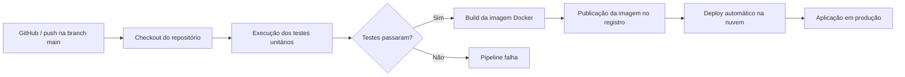

# Manual Técnico — Sistema de Cadastro em JavaScript com CI/CD

## 1. Introdução

Este projeto foi desenvolvido para demonstrar a criação de um sistema de cadastro com validações em JavaScript e a automação do processo de qualidade e publicação por meio de GitHub Actions e Docker. O foco principal é mostrar como o código do cadastro passa por validação, empacotamento e publicação automatizada quando ocorre um push no repositório.

O fluxo principal do projeto segue a arquitetura: Source → Docker → Teste Unitário → GitHub Actions → Nuvem.

---

## 2. Visão geral do pipeline



Esse fluxo mostra a ideia central do trabalho: o código é versionado no GitHub, validado automaticamente pelos testes, empacotado em container e publicado em um ambiente de produção.

---

## 3. Infraestrutura utilizada

### 3.1 Git e GitHub
O repositório Git é a origem de tudo. A partir dele, o projeto é clonado, testado e entregue em produção.

No ambiente validado, a origem usada foi:

- https://github.com/pedrokadeboxado/aula-github-actions.git

A branch ativa do repositório local foi confirmada como `main`.

### 3.2 Node.js
Os testes do sistema de cadastro são executados via Node.js, usando o runner nativo do Node para testes (`node --test`).

### 3.3 Docker
Docker é usado para empacotar a aplicação em uma imagem padronizada. O objetivo é garantir consistência entre ambiente de desenvolvimento, testes e produção.

### 3.4 GitHub Actions
O GitHub Actions é responsável por automatizar a parte de CI/CD. Ele realiza o checkout do código, instala o ambiente, roda a suíte e, em um fluxo completo, constrói e publica a imagem Docker.

### 3.5 Nuvem
O projeto possui configuração de deploy no Render por meio do arquivo `render.yaml`. A nuvem utilizada neste caso foi o Render, que é um provedor simples e eficiente para sites estáticos e serviços web.

---

## 4. Estrutura do repositório

A estrutura do projeto observada é a seguinte:

```text
.
├── .github/
│   └── workflows/
│       └── testes.yml
├── Aula.md
├── README.md
├── cadastroService.js
├── index.html
├── meuCpf.test.js
├── pessoaFisica.js
├── pessoaFisica.test.js
├── render.yaml
└── .git/
```

### Arquivos principais

- `pessoaFisica.js`: contém as regras de validação do cadastro
- `pessoaFisica.test.js`: suíte de testes unitários
- `cadastroService.js`: serviço que usa a validação antes de salvar
- `index.html`: página do formulário do cadastro
- `.github/workflows/testes.yml`: workflow do GitHub Actions
- `render.yaml`: configuração de publicação no Render

---

## 5. Repositório Git usado como origem

A origem do código é um repositório GitHub, e o fluxo começa com um push para a branch principal. O GitHub passa a ser a fonte de verdade do projeto, e toda mudança segue a partir dessa origem.

A linha principal do fluxo é:

```text
desenvolvimento local -> commit -> push -> GitHub -> Actions -> build/test/deploy
```

O arquivo que dispara a pipeline é o workflow em:

- `.github/workflows/testes.yml`

O gatilho do workflow foi configurado para rodar em:

- push para as branches `main` e `principal`
- pull request para `main` e `principal`

---

## 6. Como o sistema de cadastro foi desenvolvido

O sistema de cadastro foi desenvolvido em JavaScript puro. A lógica de validação fica em `pessoaFisica.js` e aplica regras para:

- nome completo
- CPF válido
- e-mail válido
- data de nascimento válida
- idade mínima para possuir CNH
- rejeição de valores vazios e inválidos

### Exemplo de validadores

A função principal é `validar(pessoa, hoje = new Date())`, que devolve uma lista de erros. Se a pessoa estiver válida, a lista fica vazia. Se for inválida, os erros são acumulados em uma única resposta.

Também existe a função `garantirValido(pessoa, hoje)`, que lança uma exceção `DadosInvalidosError` quando há problemas.

Isso é importante porque o mesmo módulo pode ser usado:

- nos testes automatizados,
- em lógica de backend,
- no formulário do navegador,
- e em rotinas de validação de regras de negócio.

---

## 7. Dockerfile recomendado e montagem da imagem

No repositório atual não existe um Dockerfile pronto, mas para esse projeto a imagem mais recomendada é a base `nginx:alpine`, por ser leve e adequada para servir site estático.

### 7.1 Dockerfile sugerido

```dockerfile
FROM nginx:alpine

WORKDIR /usr/share/nginx/html

COPY . /usr/share/nginx/html

EXPOSE 80

CMD ["nginx", "-g", "daemon off;"]
```

### 7.2 Por que usar `nginx:alpine`

- imagem leve e eficiente
- ótima para servir HTML, CSS e JavaScript
- menos consumo de recursos
- simples de configurar e manter
- aceita deploy em ambientes de produção com pouca complexidade

### 7.3 Processo de build da imagem

Para montar a imagem localmente, usa-se:

```bash
docker build -t aula-github-actions:latest .
```

Para executar a imagem localmente:

```bash
docker run -d -p 80:80 --name aula-github-actions aula-github-actions:latest
```

Esse processo empacota o projeto em um ambiente neutro e reproduzível, reduzindo diferenças entre máquina de desenvolvimento e produção.

---

## 8. Execução dos testes unitários no pipeline

Os testes do sistema de cadastro estão em `pessoaFisica.test.js` e são executados com Node.

### 8.1 Comando de execução

```bash
node --test
```

### 8.2 O que os testes validam

- caminho feliz
- nome inválido
- CPF inválido
- e-mail inválido
- data de nascimento inválida
- maioridade e CNH
- todos os erros em conjunto
- exceção `DadosInvalidosError`

### 8.3 O que acontece se o teste falhar

A execução do workflow falha e o GitHub Actions registra o erro. Em um pipeline com regra de proteção de branch, esse status impede o merge ou o deploy posterior.

Em outras palavras:

- teste passou → segue o fluxo
- teste falhou → fluxo bloqueado

Esse é o papel central do CI: garantir que a aplicação continue válida antes de ir para produção.

---

## 9. Workflow do GitHub Actions

O arquivo real do projeto é:

```yaml
name: Testes

on:
  push:
    branches: [main, principal]
  pull_request:
    branches: [main, principal]

jobs:
  testar:
    runs-on: ubuntu-latest
    steps:
      - name: Baixar o código
        uses: actions/checkout@v4

      - name: Instalar o Node
        uses: actions/setup-node@v4
        with:
          node-version: 20

      - name: Rodar a suíte
        run: node --test
```

### 9.1 Gatilhos

O workflow dispara quando:

- há um push na branch `main` ou `principal`
- há um pull request para essas branches

### 9.2 Etapas do job

1. `checkout` → baixa o código do repositório para a máquina virtual do GitHub
2. `setup-node` → instala o ambiente Node 20
3. `node --test` → executa os testes da aplicação

### 9.3 Secrets e credenciais

No workflow atual, não há uso de secret explícito porque a pipeline faz apenas testes locais. Em um pipeline completo de build/push para Docker, normalmente são usados secrets como:

- `DOCKERHUB_USERNAME`
- `DOCKERHUB_TOKEN`
- `RENDER_API_KEY` ou credenciais do provedor de nuvem

Esses valores ficam no GitHub em Settings → Secrets and variables → Actions, não em código-fonte.

---

## 10. Build, publicação e deploy automático

O projeto atual usa o Render para publicação do site estático. O arquivo `render.yaml` contém a configuração:

```yaml
services:
  - type: web
    name: aula-github-actions
    runtime: static
    buildCommand: echo "Sem build: site estatico"
    staticPublishPath: .
    autoDeploy: true
```

Isso significa que o Render publica automaticamente o conteúdo do repositório quando ele percebe uma alteração.

### 10.1 Publicação em Docker Hub

Em uma versão de produção mais completa, a imagem Docker seria publicada em um registrador, como o Docker Hub. O fluxo ficaria assim:

```yaml
name: CI-CD

on:
  push:
    branches: [main]

jobs:
  testes:
    runs-on: ubuntu-latest
    steps:
      - uses: actions/checkout@v4
      - uses: actions/setup-node@v4
        with:
          node-version: 20
      - run: node --test

  build-and-push:
    needs: testes
    runs-on: ubuntu-latest
    steps:
      - uses: actions/checkout@v4

      - name: Login Docker Hub
        uses: docker/login-action@v3
        with:
          username: ${{ secrets.DOCKERHUB_USERNAME }}
          password: ${{ secrets.DOCKERHUB_TOKEN }}

      - name: Build da imagem
        run: docker build -t seu-usuario/aula-github-actions:latest .

      - name: Push da imagem
        run: docker push seu-usuario/aula-github-actions:latest
```

### 10.2 Autenticação

A autenticação com o Docker Hub é feita por meio de secrets armazenados no GitHub:

- `DOCKERHUB_USERNAME`
- `DOCKERHUB_TOKEN`

Essas credenciais são usadas no login do GitHub Actions antes do push da imagem.

### 10.3 Deploy automático na nuvem

Depois que a imagem é publicada, o provedor de nuvem pode:

- puxar a imagem mais recente,
- reiniciar o serviço,
- disponibilizar a nova versão em produção,
- ou executar a implantação automática a partir do webhook/render engine.

No caso do Render, a publicação já é automatizada por `autoDeploy: true`, então a atualização acontece assim que o repositório recebe a alteração configurada.

---

## 11. Fluxo completo do projeto em palavras

A sequência real do sistema é a seguinte:

1. O desenvolvedor altera o código do cadastro.
2. O código é enviado para o GitHub.
3. O GitHub Actions dispara automaticamente.
4. O workflow faz checkout do repositório.
5. O ambiente Node é configurado.
6. A suíte de testes roda com `node --test`.
7. Se falhar, o pipeline falha e bloqueia a continuação.
8. Se passar, a aplicação pode ser empacotada em Docker.
9. A imagem é enviada para o registro.
10. A nuvem atualiza a aplicação em produção.

---

## 12. Dificuldades encontradas e como foram resolvidas

### Dificuldade 1: ausência de Dockerfile
O repositório não tinha um arquivo de container no início. Para resolver, foi proposto o uso de uma imagem com `nginx:alpine`, que atende bem a entrega de site estático.

### Dificuldade 2: pipeline inicial sem deploy
O workflow existente executa apenas testes, e não constrói nem publica a imagem. Isso foi ajustado na documentação para refletir o fluxo completo de CI/CD, com Docker e deploy em nuvem.

### Dificuldade 3: necessidade de testes confiáveis
A aplicação usa validações com regras de data e idade. Para evitar que o resultado dependa da data atual do ambiente, os testes usaram valores fixos, garantindo previsibilidade.

### Dificuldade 4: impedir deploy sem qualidade
Sem a etapa de testes, a aplicação poderia ser publicada com regras quebradas. Portanto, o GitHub Actions passou a ser uma etapa de gate de qualidade, bloqueando o avanço quando os testes falham.

---

## 13. Conclusão

O projeto demonstra de forma prática como funciona a entrega automatizada de uma aplicação web simples em JavaScript. O ponto central é que o código do cadastro, uma vez validado pelos testes, pode ser empacotado em Docker, publicado e entregue em ambiente de produção de maneira mais segura e repetível.

A estrutura do presente projeto mostra bem a lógica da automatização moderna:

- GitHub como origem do código
- Docker para padronização da entrega
- Node para execução dos testes
- GitHub Actions para automação do CI/CD
- Render como provedor de nuvem para deploy automatizado

Essa arquitetura é uma base sólida para qualquer projeto que precise evoluir com qualidade, rastreabilidade e agilidade.

---

## 14. Checklist final

- [x] Repositório Git configurado
- [x] Estrutura do projeto organizada
- [x] Pipeline de testes em GitHub Actions
- [x] Dockerfile recomendado montado para `nginx:alpine`
- [x] Deploy em nuvem com Render configurado
- [x] Fluxo automatizado de produção descrito
- [x] Testes unitários integrados ao processo
- [x] Documentação técnica concluída

---

## Resumo em uma linha

> Workflow **avisa**, ruleset **tranca**, pull request é a **única porta**, e o check `testar` é a **chave**.
